# PracticaDocker
=======

**DOCKER**

La plataforma basada en contenedores de Docker permite cargas de trabajo altamente portátiles. Los contenedores Docker pueden ejecutarse en la computadora portátil local de un desarrollador, en máquinas físicas o virtuales en un centro de datos, en proveedores de nube o en una combinación de entornos.

- **¿Qué es un contenedor?**

Un proceso asilado que se ejecuta en una maquina host que se encuentra apartada de los demás procesos que se ejecutan en el mismo host.

- **¿Qué es una imagen?**

Un contenedor en ejecución utiliza un listado de archivos, este sistema de archivos proporciona una imagen, la imagen debe contener todo lo necesario para ejecutar una aplicación todas las dependencias, configuraciones, scripts, archivos binarios, etc

**Contenerizar una aplicación**

**Paso 1.**

Se clona la aplicación contenida en el repositorio **<https://github.com/docker/getting-started-app.git>** 

**Paso 2.**

Se verifica el contenido del repositorio mediante el editor de Play with Docker

**Paso 3.**

Ingresar a la ruta **getting-started-app**  y se crea el archivo **Dockerfile**

**Paso 4.**

Usando el editor se modifica el archivo Dockerfile para que baje la App *node:18-alpine.* Dar guardar

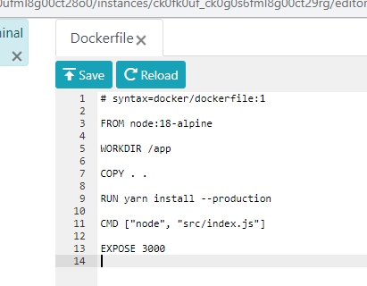

**Paso 5.**

Con el siguiente comando se crea la imagen del Dockerfile.  “docker build -t **getting-started** .” especificando al final del comando el nombre con el que queremos crearla, posteriormente  se verifica su existencia mediante  docker images 

**Paso 6.**

Se ejecuta la imagen que se creó mediante el comando *docker run -dp :3000:3000 **getting-started***

Se especifica el nombre de la imagen al final del comando según como lo hayamos nombrado anteriormente.  Donde el –d significa que va a ejecutar en segundo plano, -p especifica el host y el puerto en que se va a levantar la aplicación en nuestro caso no se especifica el host.

**Paso 7.**

Al navegar sobre el **Front** se puede ver la funcionalidad de la App, se hacen pruebas agregando dos Items

**SECCIÓN 3**

**Paso 1.**

Validación los containers creados mediante el comando *docker ps*

**Paso 2.**

Modificar texto del **front** para crear una nueva imagen con un texto diferente.

**Paso 3.**

Al momento de ejecutar la nueva imagen creada arroja el error:

**Paso 4.**

Donde especifica que tiene conflictos con el puerto 3000, por lo tanto, se ejecuta el comando docker ps donde podemos ver los puertos utilizados y sus respectivos contenedores.

**Paso 5.**

Se evidencia que se encuentra un contendedor ocupando el puerto 3000, por lo tanto, procedemos a detener mediante el comando docker stop, especificando el ID del contenedor.

**Paso 6**

Una vez detenido el contenedor procedemos a removerlo mediante el comando **docker rm** especificando** el ID del contenedor.

**Paso 7.**

Posterior a remover el contendor procedemos a ejecutarlo nuevamente mediante el comando *docker run -dp :3000:3000 getting-started*

Se procede a verificar la App, en donde se podrá ver el cambio realizado al texto.

**SECCIÓN 4.**

**Parte 1.**

Se accede a DockerHub y se crea un nuevo repositorio donde vamos a versionar la imagen modificada. 

**Parte 2.**

Al ejecutar el comando docker push cballen/getting-started:tagname

**Parte 3.**

Arroja un error debido a que aún no hemos realizado el login, por lo tanto, se debe realizar el login docker login -u YOUR-USER-NAME, ingresando la contraseña

**Parte 4.**

Se ejecuta el comando docker tag getting-started YOUR-USER-NAME/getting-started, cambiando el nombre del usuario, espeficiando el nombre del repositorio

**Parte 5.**

Se realiza el push al repositorio enviando la última versión. 

**Parte 6.**

Se verifica el Dockehub evidenciando que la imagen quedó guardada.

**SECCIÓN 5**

**Parte 1.**

Se crea una imagen de ubuntu mediante el comando 

docker run -d ubuntu bash -c "shuf -i 1-10000 -n 1 -o /data.txt && tail -f /dev/null"

**Parte 2.**

Se verifica la existencia de las imágenes creadas mediante el comando.

docker ps

**Parte 3.**

Seguido de esto se accede a la imagen de ubuntu mediante el comando, debemos verificar el ID de la imagen y cambiarlo en el comando

docker exec <container-id> cat /data.txt

**Parte 4.**

Podemos observar que arrojò un numero aleatorio de 1 a 1000, lo que comprueba la ejecución y existencia de la imagen, de igual manera lo podemos ver con el comando docker ps.

Al ejecutar nuevamente el comando, se crea una nueva imagen.

docker run -d ubuntu bash -c "shuf -i 1-10000 -n 1 -o /data.txt && tail -f /dev/null" 

**Parte 5.**

Se verifica la existencia de dos imágenes con ubuntu de la siguiente manera

**Parte 6.**

Al ejecutar y listar lo que existe en la carpeta raíz de la imagen, se observa que no se encuentra el archivo data.txt puesto que fue creado de manera temporal en la imagen anterior.

**Parte 7.**

Se elimina el primer contendor usando: se debe tener en cuenta el id del contendor que queremos borrrar. 

docker rm -f <container-id>

**Parte 8.**	               **[Volúmenes de contenedores](https://docs.docker.com/get-started/05_persisting_data/#container-volumes)**

Se crea el volumen con la base en sql-lite con el nombre todo-db

**Parte 9.**

Antes de continuar detenemos y eliminamos el contenedor App pendientes, teniendo en cuenta el ID

**Parte 10.**

Montamos nuevamente el contendor esta vez agregando el –mount agregandolo al volumen todo-db 

**Parte 11.**

Verificamos y agregamos items en el App.

**Parte 12.**

Detenemos y eliminamos el contenedor nuevamente, debemos ver nuevamente el ID con docker ps.

Se monta nuevamente el contenedor.

**Parte 13.**

Verificamos que los datos que habíamos ingresado quedaron guardados debido a que incluyó que se pudiese guardar en la base todo-db.

**Parte 14.**

Verificar la ubicación y existencia de la base todo-db

**SECCIÓN 6.**

Para esta parte vamos a utilizar bind mounts, el cual es una herramienta que nos sirve para que el contenedor que tenemos actualmente ejecutando, quede sincronizado con el código fuente y de esta manera cuando se hagan cambios en el código fuente, vamos a ver reflejados los cambios en el contenedor.
Entramos en la ruta del código fuente:
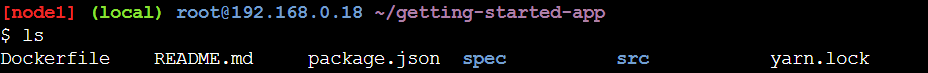

Ejecutamos el siguiente comando “docker run -it --mount type=bind,src="$(pwd)",target=/src ubuntu bash” para iniciar una sesión en un contenedor Ubuntu con un "bind mount".
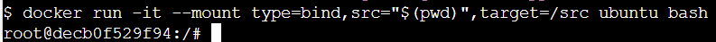

El parámetro --mount indica a Docker que cree un "bind mount", donde "src" es el directorio de trabajo actual (getting-started-app) y "target" es dónde ese directorio debe aparecer dentro del contenedor (/src).

Ahora podemos navegar dentro del directorio:
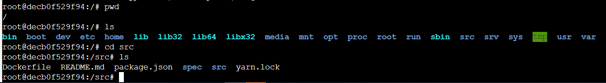

Ahora creamos un nuevo archivo

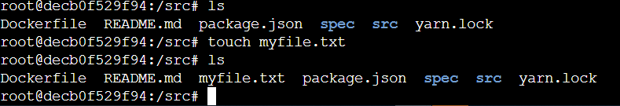

Y si vemos el directorio, vamos a ver el archivo creado:
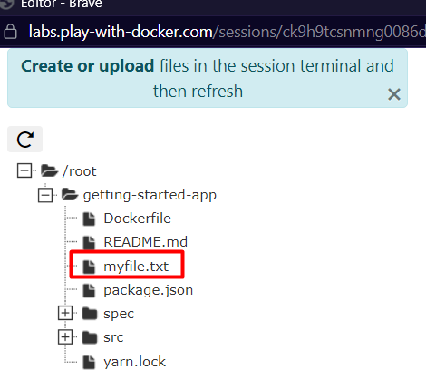

Con control + d detenemos esta sesión

Y ahora iniciaremos nuevamente el contenedor, pero con bind mounts, con este comando, adicionalmente iniciando una sh que ejecuta Yarn install para instalar paquetes y luego ejecuta Yarn run dev para iniciar el servidor de desarrollo:
docker run -dp 127.0.0.1:3000:3000 \
    -w /app --mount type=bind,src="$(pwd)",target=/app \
    node:18-alpine \
    sh -c "yarn install && yarn run dev"

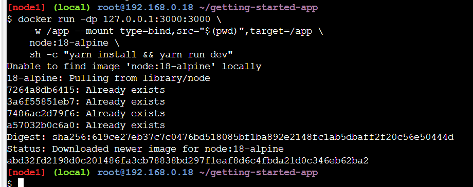

Y podemos ver la logs que genera mediante el siguiente comando:
“docker logs <container-id>”

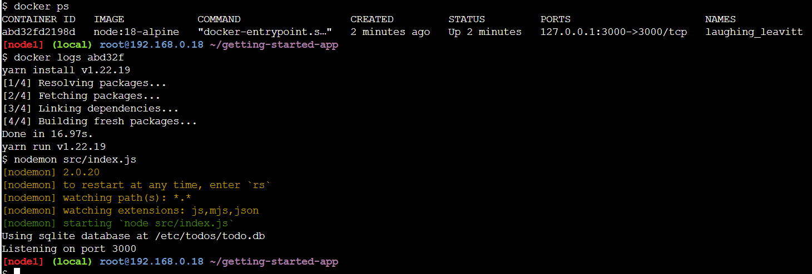

Y de esta manera tenemos nuestro proyecto sincronizado

**SECCIÓN 7.**

Vamos a iniciar creando la red donde vamos a conectar sql con el siguiente comando:
$ docker network create todo-app

Porteriormente vamos a iniciar un contenedor de MySQL y conectarlo a la red con el siguiente comando:
$ docker run -d \
    --network todo-app --network-alias mysql \
    -v todo-mysql-data:/var/lib/mysql \
    -e MYSQL_ROOT_PASSWORD=secret \
    -e MYSQL_DATABASE=todos \
    mysql:8.0

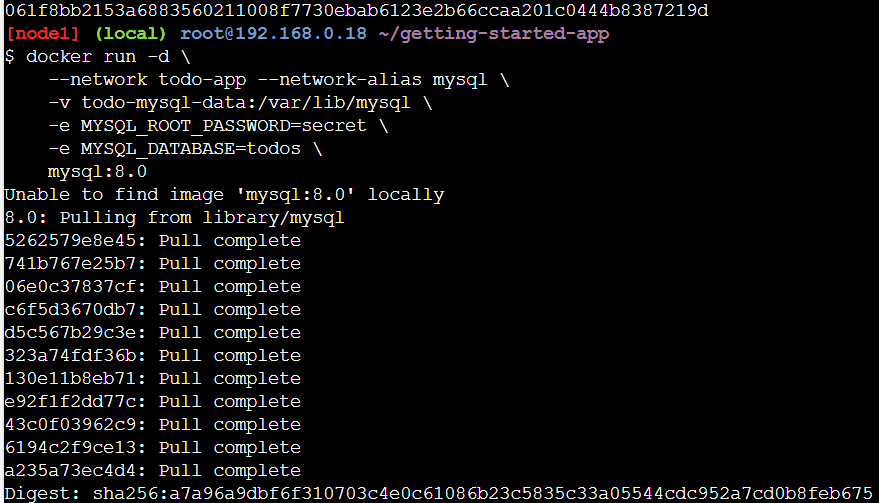

Vamos a conectarnos a la base de datos y validar que se pueda establecer conexión con el siguiente comando:
docker exec -it <ID-del-contenedor-de-mysql> mysql -u root –p

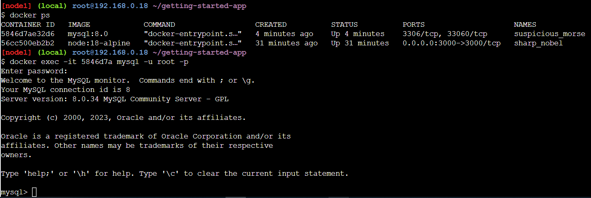

Ahora validamos las bases de datos que existen:

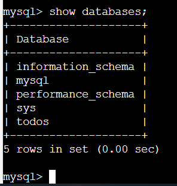

Ahora iniciamos un nuevo contenedor bajo la misma red creada. Con el siguiente comando:
docker run -it --network todo-app nicolaka/netshoot

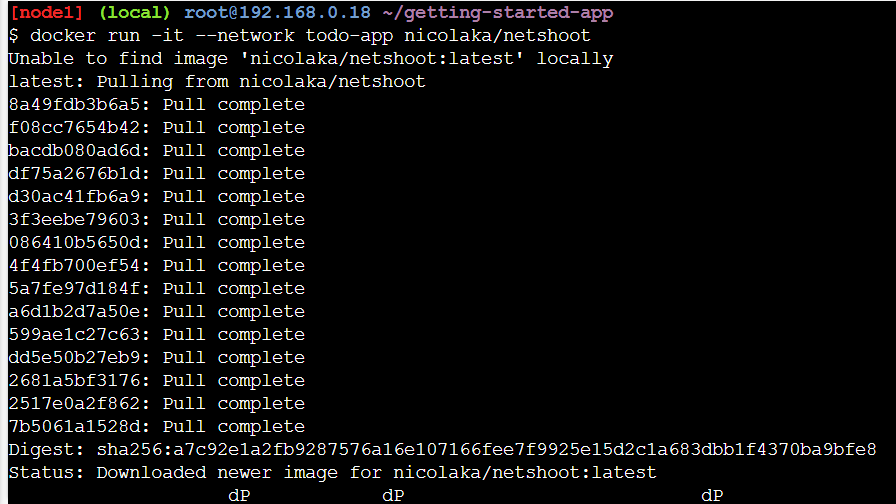

Dentro del contenedor, vamos a utilizar el comando dig, que es una herramienta DNS útil, para buscar la dirección IP del nombre de host mysql.

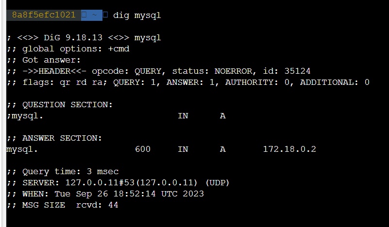

Ahora vamos a ejecutar nuestro proyecto bajo la red creada con este comando:
docker run -dp 127.0.0.1:3000:3000 \
  -w /app -v "$(pwd):/app" \
  --network todo-app \
  -e MYSQL_HOST=mysql \
  -e MYSQL_USER=root \
  -e MYSQL_PASSWORD=secret \
  -e MYSQL_DB=todos \
  node:18-alpine \
  sh -c "yarn install && yarn run dev"

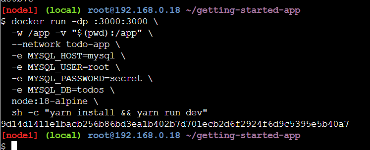

Ahora nos conectamos nuevamente a la base de datos y validamos que existan los items que creamos:

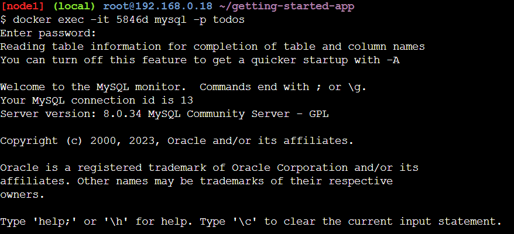

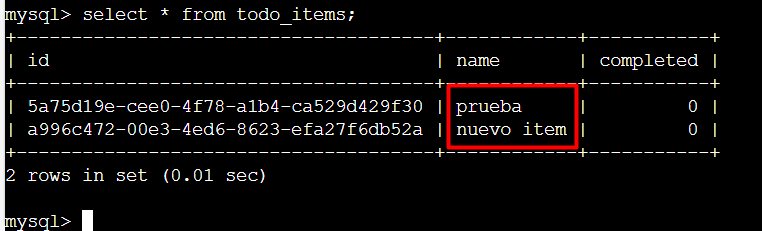

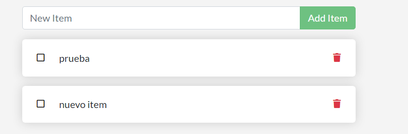

De esta manera nos aseguramos de la persistencia con la base de datos.

**SECCIÓN 8.**

Creamos el archivo compose, el cual va a ser un yaml

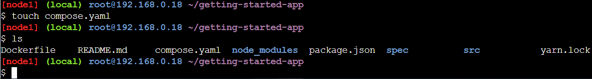

Y definimos en el yaml todos los comandos que hemos realizado anteriormente:

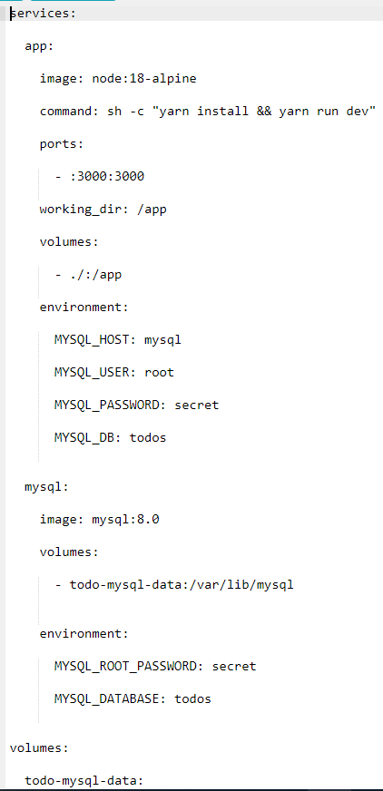

Ahora nos aseguramos que no tengamos ningún contenedor ejecutanse en el momento

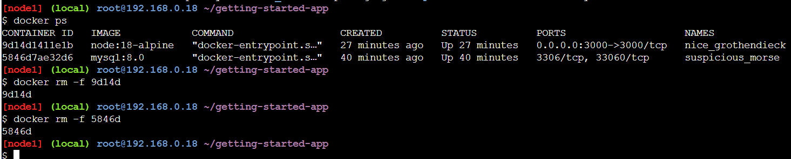

Y procedemos a ejecutar la aplicación mediante el archivo compose con el siguiente comando: “docker compose up –d”

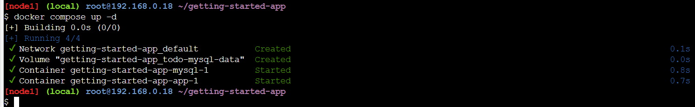

Podemos ver la historia de la imagen con el siguiente comando “docker image history getting-started”

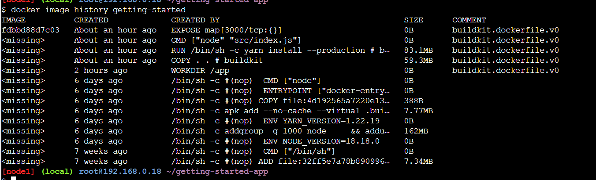

